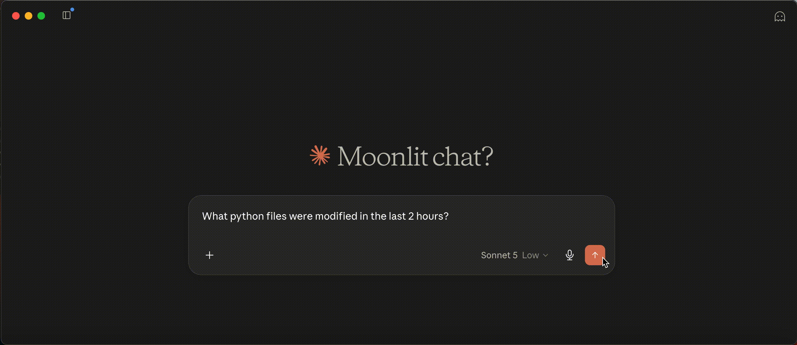

# 🔍 file-search-mcp

A cross-platform MCP server for searching your files by name, content, extension, or modification time - directly from chat. 



Works with any MCP-compatible client (e.g. Claude desktop, Cursor, ChatGPT desktop) - Built with [FastMCP](https://github.com/jlowin/fastmcp).

## Setup
#### _Requirements: Python 3.10+_

Clone the repo anywhere you like
```bash
git clone https://github.com/samconibear/mcp-filesearch.git
```

Then run the setup script for your platform. It will create a virtual environment, install dependencies, and wire up `claude_desktop_config.json` automatically.

⚠️ **The setup scripts are configured for Claude Desktop. For other clients, use the config snippet in the [Search scope](#search-scope) section as a reference.**


**macOS / Linux**
```bash
bash scripts/setup-unix.sh
```

**Windows** (PowerShell)
```powershell
.\scripts\setup-windows.ps1
```

Then restart Claude Desktop.

## Search scope

All searches are scoped to a single **root directory** — the server cannot read files outside it. The root is set by the first argument passed to `main.py`.

The setup script defaults to your home directory. To change it, edit the `args` field in `claude_desktop_config.json`:

```json
{
  "mcpServers": {
    "file-search": {
      "command": "/path/to/mcp-filesearch/.venv/bin/python",
      "args": [
        "/path/to/mcp-filesearch/src/main.py",
        "/the/directory/you/want/searched"
      ]
    }
  }
}
```

Then restart Claude Desktop. You can point it at any directory - your home folder, a specific project, a mounted drive, etc.

For security, scope the root as narrowly as possible rather than pointing it at `/` or your entire home directory.
